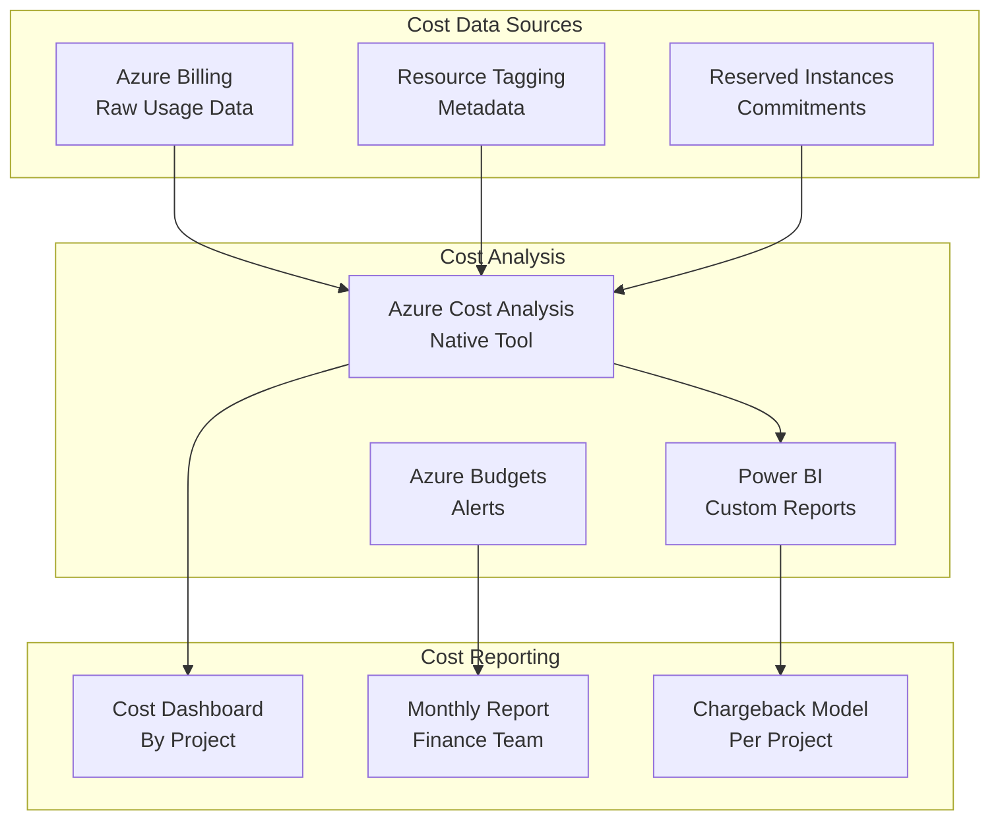

# Cost Management & Optimization

## Overview

Comprehensive cost management strategy for the banking sector landing zone with focus on visibility, control, and optimization.

## Cost Visibility Architecture



## Cost Allocation Strategy

### Resource Tagging for Cost Attribution

**Mandatory Cost Tags:**

| Tag Name | Values | Example |
|----------|--------|---------|
| `Environment` | Production, Staging, Development | Production |
| `Project` | Project-A, Project-B, Project-C | Project-A |
| `CostCenter` | Finance Code (e.g., CC-1001) | CC-1001 |
| `Owner` | Email address | project.owner@banking.com |
| `ApplicationName` | Application identifier | Banking-App-A1 |
| `DataClassification` | Public, Internal, Confidential, Restricted | Confidential |
| `BusinessUnit` | Department | Finance, Trading, Risk |
| `Department` | Detailed department | Treasury Operations |

### Cost Allocation Model

```
Organization Level
├── Project A: $X/month
│   ├── Prod Environment: $X1/month
│   │   ├── App 1: $X1a/month
│   │   └── App 2: $X1b/month
│   └── Dev Environment: $X2/month
├── Project B: $Y/month
│   └── Prod Environment: $Y1/month
└── Shared Services: $Z/month
    ├── Networking: $Z1/month
    ├── Monitoring: $Z2/month
    └── Identity: $Z3/month
```

## Budget Controls

### Budget Tiers

| Budget Level | Owner | Alert Threshold | Scope |
|-------------|-------|-----------------|-------|
| Organization | CFO | 80%, 100% | All costs |
| Management Group (Projects) | Finance | 75%, 100% | Project costs |
| Project | Project Owner | 70%, 100% | Project total |
| Subscription | Sub Owner | 60%, 90% | Sub spending |
| Resource Group | RG Owner | 50%, 80% | RG spending |

### Budget Alert Configuration

```json
{
  "name": "budget-project-a-monthly",
  "displayName": "Project A Monthly Budget Alert",
  "amount": 10000,
  "timeGrain": "Monthly",
  "timePeriod": {
    "startDate": "2024-01-01T00:00:00Z",
    "endDate": "2025-12-31T23:59:59Z"
  },
  "category": "Cost",
  "notifications": {
    "80_percent_notification": {
      "enabled": true,
      "operator": "GreaterThan",
      "threshold": 80,
      "contactEmails": ["project-owner@banking.com"],
      "contactRoles": ["Owner"],
      "contactGroups": ["/subscriptions/{}/resourceGroups/rg-banking/providers/microsoft.insights/actionGroups/ag-project-a"]
    },
    "100_percent_notification": {
      "enabled": true,
      "operator": "GreaterThanOrEqual",
      "threshold": 100,
      "contactEmails": ["cfo@banking.com"],
      "contactRoles": ["Owner"]
    }
  }
}
```

## Cost Optimization Strategies

### 1. Right-Sizing

**Current State Analysis:**
```kusto
// Identify underutilized resources
Perf
| where TimeGenerated > ago(30d)
| summarize AvgCPU = avg(CounterValue)
| where CounterName == "% Processor Time"
| where AvgCPU < 20
| project Computer, AvgCPU
```

**VM Sizing Recommendations:**
- VMs with < 20% avg CPU: Downsize to lower SKU
- VMs with < 10% CPU: Consolidate or decommission
- Memory usage < 40%: Consider smaller instance family

**Database Sizing:**
- SQL Database: Review DTU consumption, consider vCore model
- Cosmos DB: Adjust RU provisioning based on actual usage
- PostgreSQL: Right-size compute and storage tiers

### 2. Reserved Instances & Savings Plans

**Target Utilization**: 70%+ of compute workload on reserved capacity

**Recommendation Strategy:**
```
Month 1-3: Run Advisor analysis
Month 3-4: Commit to 1-year RIs for core infrastructure
Month 6+: Evaluate 3-year RIs for stable workloads

Savings Potential:
- 1-year RI: 25-35% discount
- 3-year RI: 40-65% discount
- VM Reserved Instances: Target $X savings
- SQL Database Reserved Capacity: Target $Y savings
```

### 3. Spot VMs for Non-Critical Workloads

**Dev/Test Environment Optimization:**
```hcl
# Terraform configuration
resource "azurerm_virtual_machine" "dev_spot" {
  name                = "vm-dev-spot-001"
  location            = var.location
  resource_group_name = azurerm_resource_group.rg.name
  vm_size             = "Standard_D4s_v3"

  priority = "Spot"
  eviction_policy = "Deallocate"
  max_bid_price = 0.50  // Pay-as-you-go price

  # Rest of configuration...
}
```

**Estimated Savings**: 70-90% off on-demand pricing

### 4. Auto-Scaling Configuration

**Scale-in Policies:**
```
Rule: CPU < 30% for 10 minutes → Scale down
Rule: Memory < 40% for 10 minutes → Scale down
Cooldown: 5 minutes between scale operations
```

**Cost Impact:**
- Peak hours: Auto-scale UP for performance
- Off-peak: Auto-scale DOWN for cost
- Estimated savings: 20-30% on compute

### 5. Storage Optimization

| Storage Tier | Usage Pattern | Cost Advantage |
|-------------|---------------|-----------------|
| Hot | Frequent access | Baseline cost |
| Cool | Infrequent access (< 30 days) | 50% storage discount |
| Archive | Long-term retention | 80% storage discount |
| Lifecycle Policy | Auto-transition | 30-40% overall savings |

**Lifecycle Policy Example:**
```json
{
  "rules": [
    {
      "name": "move-to-cool",
      "enabled": true,
      "type": "Lifecycle",
      "definition": {
        "actions": {
          "baseBlob": {
            "tierToCool": {
              "daysAfterModificationGreaterThan": 30
            }
          }
        },
        "filters": {
          "blobTypes": ["blockBlob"]
        }
      }
    },
    {
      "name": "move-to-archive",
      "enabled": true,
      "type": "Lifecycle",
      "definition": {
        "actions": {
          "baseBlob": {
            "tierToArchive": {
              "daysAfterModificationGreaterThan": 90
            }
          }
        }
      }
    }
  ]
}
```

## Cost Reporting & Dashboards

### Monthly Cost Report Template

**Report Sections:**
1. **Executive Summary**
   - Total spend vs. budget
   - Month-over-month change
   - Key variances
   - Recommendations

2. **Spend by Project**
   - Project A: $X
   - Project B: $Y
   - Shared Services: $Z
   - Trends and forecasts

3. **Spend by Service Type**
   - Compute: $A (40%)
   - Storage: $B (20%)
   - Database: $C (25%)
   - Networking: $D (10%)
   - Other: $E (5%)

4. **Cost Optimization Opportunities**
   - Identified savings
   - Implementation timeline
   - Expected impact

5. **Reserved Instance Analysis**
   - Coverage percentage
   - Unused commitments
   - Recommended purchases

### Cost Dashboard (Power BI)

**Dashboard Pages:**
1. **Overview** - Total spend, trends, forecasts
2. **By Project** - Detailed project breakdown
3. **By Service** - Service type analysis
4. **Trends** - 12-month historical view
5. **Optimization** - Recommendations and impact
6. **RI Analysis** - Reserved instance coverage

**Key Metrics:**
- Total Monthly Spend: $X
- Average Daily Spend: $Y
- Month-to-Date: $Z
- Projected Monthly: $P
- Budget Variance: +/- %

## Anomaly Detection

### Cost Anomaly Patterns

**Alert Scenarios:**

1. **Unusual Spike (> 25% above baseline)**
```kusto
let baseline = AzureCosts
| where TimeGenerated between (ago(60d) .. ago(30d))
| summarize AvgCost = avg(PreTaxCost) by bin(TimeGenerated, 1d);

AzureCosts
| where TimeGenerated > ago(30d)
| summarize DailyCost = sum(PreTaxCost) by bin(TimeGenerated, 1d)
| join kind=inner baseline on TimeGenerated
| where DailyCost > (AvgCost * 1.25)
| project Date = TimeGenerated, CurrentCost = DailyCost, BaselineCost = AvgCost, Variance = ((DailyCost - AvgCost) / AvgCost * 100)
```

2. **New Resource Costs**
```kusto
AzureCosts
| where ResourceGroup startswith "rg-" and TimeGenerated > ago(7d)
| summarize TotalCost = sum(PreTaxCost) by ResourceId, ResourceType, ResourceGroup
| where TotalCost > 100  // Alert if > $100 cost
| order by TotalCost desc
```

3. **Idle Resources**
```kusto
Perf
| where TimeGenerated > ago(30d)
| where CounterName == "% Processor Time"
| summarize AvgCPU = avg(CounterValue) by Computer
| where AvgCPU < 5  // Consistently low CPU
```

## Forecasting Model

**Monthly Cost Projection:**
- Historical trend: Last 3 months average
- Growth rate: YoY or QoQ
- Seasonal factors: Holiday periods, project cycles
- Planned changes: Scaling, new projects

**Formula:**
```
Projected Cost = (Last 3 Month Average) × Growth Factor + Seasonal Adjustment + Planned Changes
```

## Cost Governance Policies

### Policy 1: Reservation Requirement

For Production compute resources:
- Minimum 1-year reserved instances required
- Exception: Temporary/scaling resources
- Review quarterly for optimization

### Policy 2: Naming Convention for Cost Tracking

All resources must include cost center tag:
- `CostCenter`: Finance code for billing
- `Project`: Project identifier
- `Environment`: Prod/Staging/Dev

### Policy 3: Decommissioning Process

Resources unused for 30+ days:
1. Send notification to owner
2. Scale down to minimal capacity
3. Schedule decommission at 60 days
4. Final backup and deletion at 90 days

## Financial Tracking Integration

### SIEM/Accounting Integration

Export cost data to accounting systems:
```
Daily: Azure Cost Management → CSV
Weekly: Process costs → Cost allocation
Monthly: Finalize → Chargeback reports
Quarterly: Audit → Financial statements
```

### Chargeback Model

**Formula:**
```
Project Cost = Direct Costs + (Shared Services × Allocation %)

Allocation Method:
- Compute: By actual resource allocation
- Storage: By usage (GB-months)
- Networking: By bandwidth consumed
- Shared (Security, Monitoring): By resource count
```

---

**Document Version**: 1.0  
**Last Updated**: June 2026
