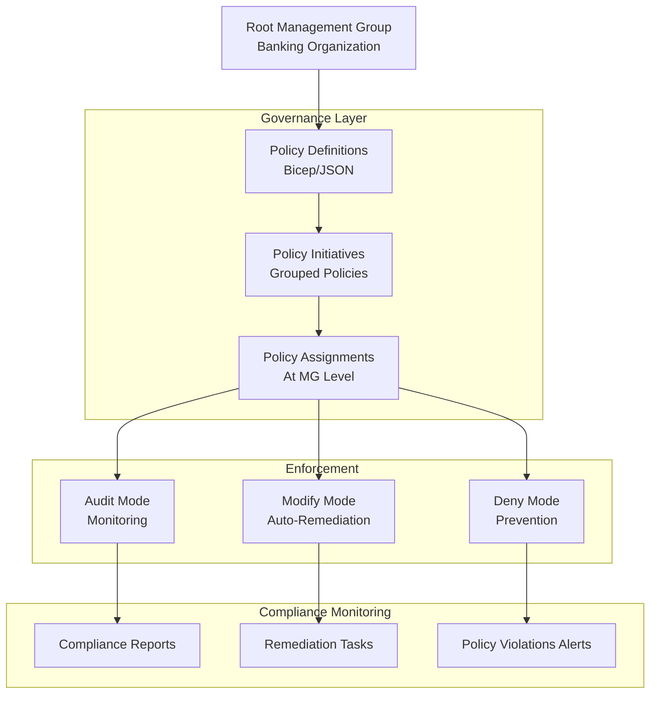
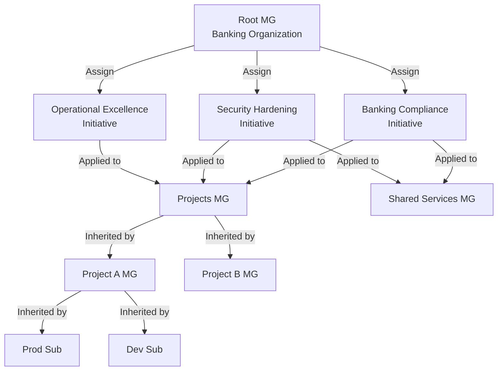
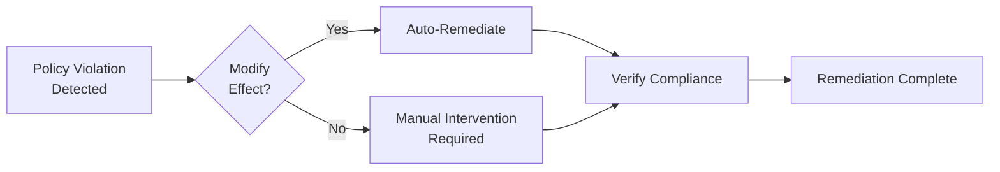

# Governance & Policy as Code Framework

## Overview

This document details the governance framework for the banking sector landing zone, emphasizing centralized control, compliance, and operational consistency through Policy-as-Code.

## Governance Architecture



## Azure Policy Definitions

### 1. Mandatory Private Endpoints Policy

**Policy Name**: `require-private-endpoints-for-paas`  
**Effect**: Deny  
**Target Services**: SQL Database, Storage, Key Vault, Container Registry, Service Bus

```json
{
  "mode": "All",
  "policyRule": {
    "if": {
      "allOf": [
        {
          "field": "type",
          "in": [
            "Microsoft.Sql/servers",
            "Microsoft.Storage/storageAccounts",
            "Microsoft.KeyVault/vaults",
            "Microsoft.ContainerRegistry/registries",
            "Microsoft.ServiceBus/namespaces"
          ]
        },
        {
          "field": "Microsoft.Sql/servers/publicNetworkAccess",
          "equals": "Enabled"
        }
      ]
    },
    "then": {
      "effect": "deny"
    }
  }
}
```

### 2. Encryption at Rest Policy

**Policy Name**: `require-encryption-at-rest`  
**Effect**: Deny  
**Scope**: All storage and database resources

```json
{
  "mode": "All",
  "policyRule": {
    "if": {
      "allOf": [
        {
          "field": "type",
          "in": [
            "Microsoft.Sql/servers/databases",
            "Microsoft.Storage/storageAccounts",
            "Microsoft.Cosmos/databaseAccounts"
          ]
        },
        {
          "field": "Microsoft.Sql/servers/databases/transparentDataEncryption/status",
          "notEquals": "Enabled"
        }
      ]
    },
    "then": {
      "effect": "deny"
    }
  }
}
```

### 3. Mandatory Tagging Policy

**Policy Name**: `require-mandatory-tags`  
**Effect**: Deny  
**Scope**: All resources

**Required Tags:**
- `Environment` (values: Production, Staging, Development)
- `Project` (values: Project-A, Project-B, Project-C)
- `Owner` (value: Email address)
- `CostCenter` (value: Finance code)
- `ApplicationName` (value: Application identifier)
- `DataClassification` (values: Public, Internal, Confidential, Restricted)

```json
{
  "mode": "All",
  "policyRule": {
    "if": {
      "allOf": [
        {
          "field": "type",
          "notEquals": "Microsoft.Resources/subscriptions/resourceGroups"
        },
        {
          "anyOf": [
            {
              "field": "tags['Environment']",
              "exists": "false"
            },
            {
              "field": "tags['Project']",
              "exists": "false"
            },
            {
              "field": "tags['Owner']",
              "exists": "false"
            },
            {
              "field": "tags['CostCenter']",
              "exists": "false"
            },
            {
              "field": "tags['ApplicationName']",
              "exists": "false"
            },
            {
              "field": "tags['DataClassification']",
              "exists": "false"
            }
          ]
        }
      ]
    },
    "then": {
      "effect": "deny"
    }
  }
}
```

### 4. Allowed Locations Policy

**Policy Name**: `allowed-locations-south-africa`  
**Effect**: Deny  
**Allowed Location**: South Africa North  
**Scope**: All resources

```json
{
  "mode": "All",
  "policyRule": {
    "if": {
      "allOf": [
        {
          "field": "type",
          "notEquals": "Microsoft.Resources/subscriptions/resourceGroups"
        },
        {
          "field": "location",
          "notIn": [
            "southafricanorth"
          ]
        }
      ]
    },
    "then": {
      "effect": "deny"
    }
  }
}
```

### 5. Allowed Resource Types Policy

**Policy Name**: `allowed-resource-types`  
**Effect**: Deny  
**Scope**: All resources

**Allowed Types:**
- Compute: App Service, AKS, Azure Functions, Virtual Machines, Container Instances
- Database: SQL Server, SQL Database, Cosmos DB, PostgreSQL
- Storage: Storage Accounts, Data Lake Storage, Backup Vault
- Networking: Virtual Networks, Application Gateway, Load Balancer, Firewall
- Monitoring: Application Insights, Log Analytics, Alert Rules
- Security: Key Vault, Managed Identity
- Integration: Service Bus, Event Hub, API Management

```json
{
  "mode": "All",
  "policyRule": {
    "if": {
      "allOf": [
        {
          "field": "type",
          "notIn": [
            "Microsoft.Web/sites",
            "Microsoft.ContainerService/managedClusters",
            "Microsoft.Compute/virtualMachines",
            "Microsoft.Sql/servers",
            "Microsoft.Sql/servers/databases",
            "Microsoft.Cosmos/databaseAccounts",
            "Microsoft.Storage/storageAccounts",
            "Microsoft.Network/virtualNetworks",
            "Microsoft.Network/networkSecurityGroups",
            "Microsoft.Insights/components",
            "Microsoft.OperationalInsights/workspaces",
            "Microsoft.KeyVault/vaults",
            "Microsoft.ManagedIdentity/userAssignedIdentities"
          ]
        }
      ]
    },
    "then": {
      "effect": "deny"
    }
  }
}
```

### 6. Audit Logging Policy

**Policy Name**: `require-audit-logging-enabled`  
**Effect**: Audit  
**Scope**: Storage, SQL, Key Vault

```json
{
  "mode": "All",
  "policyRule": {
    "if": {
      "field": "type",
      "in": [
        "Microsoft.Sql/servers",
        "Microsoft.Storage/storageAccounts",
        "Microsoft.KeyVault/vaults"
      ]
    },
    "then": {
      "effect": "audit"
    }
  }
}
```

### 7. Auto-Remediation Policy (Modify Effect)

**Policy Name**: `auto-remediate-missing-tags`  
**Effect**: Modify  
**Scope**: All resources

Automatically adds a default value for missing tags:

```json
{
  "mode": "All",
  "policyRule": {
    "if": {
      "allOf": [
        {
          "field": "tags['Environment']",
          "exists": "false"
        }
      ]
    },
    "then": {
      "effect": "modify",
      "details": {
        "roleDefinitionIds": [
          "/subscriptions/{subscriptionId}/providers/Microsoft.Authorization/roleDefinitions/b24988ac-6180-42a0-ab88-20f7382dd24c"
        ],
        "operations": [
          {
            "operation": "add",
            "path": "/tags/Environment",
            "value": "Development"
          }
        ]
      }
    }
  }
}
```

## Policy Initiatives

### Initiative 1: Banking Sector Compliance

**Name**: `banking-sector-compliance-initiative`  
**Description**: Comprehensive compliance framework for banking organizations

**Included Policies:**
1. Require Private Endpoints for PaaS
2. Require Encryption at Rest
3. Require Mandatory Tags
4. Require Audit Logging Enabled
5. Allowed Locations (South Africa North)
6. Require Network Security Groups
7. Require MFA for User Access

### Initiative 2: Operational Excellence

**Name**: `operational-excellence-initiative`  
**Description**: Ensure operational consistency and monitoring

**Included Policies:**
1. Require Diagnostic Settings
2. Require Application Insights
3. Require Monitoring Enabled
4. Auto-Remediate Missing Tags
5. Require Naming Convention (via Custom Policy)

### Initiative 3: Security Hardening

**Name**: `security-hardening-initiative`  
**Description**: Enforce security best practices

**Included Policies:**
1. Require Private Endpoints
2. Require Encryption
3. Deny Public IP for Databases
4. Require HTTPS Only
5. Require TLS 1.2 Minimum
6. Deny Storage Account Public Blob Access

## Policy Assignment Strategy



### Policy Exclusions

**When NOT to apply certain policies:**

| Policy | Exclusion | Reason |
|--------|-----------|--------|
| Private Endpoints | Dev/Test resources | Cost optimization |
| Encryption at Rest | Temporary test data | Performance |
| Mandatory Tags | Internal automation resources | N/A for system resources |
| Allowed Locations | Backup vault (if required elsewhere) | Data residency requirements |

## Naming Convention Policy

**Policy Name**: `enforce-naming-convention`  
**Effect**: Deny

```json
{
  "mode": "All",
  "policyRule": {
    "if": {
      "allOf": [
        {
          "field": "type",
          "equals": "Microsoft.Compute/virtualMachines"
        },
        {
          "field": "name",
          "notMatch": "vm-[a-z]+-[a-z]+-###"
        }
      ]
    },
    "then": {
      "effect": "deny"
    }
  }
}
```

**Naming Convention Pattern:**
- Virtual Machines: `vm-projectname-resourcetype-###`
  - Example: `vm-projecta-appsrv-001`
- Storage Accounts: `st[projectname][environment]###`
  - Example: `stprojectaprod001`
- SQL Databases: `sqldb-projectname-environment-###`
  - Example: `sqldb-projecta-prod-001`
- Key Vault: `kv-projectname-environment-###`
  - Example: `kv-projecta-prod-001`

## Compliance Monitoring

### Compliance Dashboard Queries (KQL)

**Policy Compliance Status:**
```kusto
policyresources
| where type == "microsoft.policyinsights/policystates"
| summarize TotalResources = count(), 
            CompliantResources = countif(complianceState == "Compliant"),
            NonCompliantResources = countif(complianceState == "NonCompliant")
            by policyDefinitionId
| project Policy = policyDefinitionId, 
          Compliant = CompliantResources,
          NonCompliant = NonCompliantResources,
          ComplianceRate = round((CompliantResources * 100.0) / TotalResources, 2)
```

**Non-Compliant Resources:**
```kusto
policyresources
| where type == "microsoft.policyinsights/policystates"
| where complianceState == "NonCompliant"
| project ResourceId = resourceId,
          PolicyName = policyDefinitionName,
          ResourceType = resourceType,
          Reason = reason
| order by ResourceType
```

## Remediation Process

### Automated Remediation
- Policies with "Modify" effect automatically fix non-compliant resources
- Examples: Adding missing tags, enabling logging

### Manual Remediation
- For "Deny" effect violations, resources must be deleted/recreated
- For "Audit" violations, review and decide on remediation

### Remediation Workflow



## Policy Compliance Reporting

**Monthly Compliance Report:**
- Overall compliance percentage
- Top non-compliant resources
- Policies with most violations
- Remediation status
- Recommendations for improvement

**Quarterly Policy Review:**
- Effectiveness of current policies
- New policies needed
- Policies to deprecate
- Policy updates based on security threats

---

**Document Version**: 1.0  
**Last Updated**: June 2026
