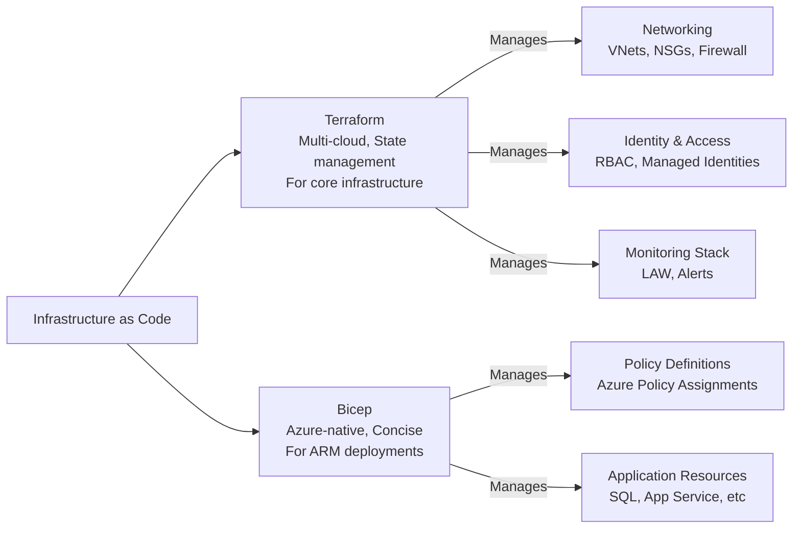

# Infrastructure as Code & Deployment Pipeline

## Overview

This document provides the complete CI/CD and Infrastructure-as-Code strategy for the banking sector landing zone using Terraform, Bicep, and GitHub Actions.

## IaC Strategy

### Technology Selection



**Why Terraform for core infrastructure?**
- State management and drift detection
- Team collaboration
- Multi-environment support
- Consistent workflow across cloud providers

**Why Bicep for policies and applications?**
- Native Azure integration
- Simpler syntax than JSON ARM templates
- Built-in policy support
- Direct Azure Resource Manager integration

## Repository Structure

```
banking-infrastructure/
├── README.md
├── .github/
│   ├── workflows/
│   │   ├── validate-infrastructure.yml
│   │   ├── plan-infrastructure.yml
│   │   └── deploy-infrastructure.yml
│   └── CODEOWNERS
├── terraform/
│   ├── environments/
│   │   ├── dev/
│   │   │   ├── terraform.tfvars
│   │   │   └── backend.tf
│   │   ├── staging/
│   │   │   ├── terraform.tfvars
│   │   │   └── backend.tf
│   │   └── prod/
│   │       ├── terraform.tfvars
│   │       └── backend.tf
│   ├── modules/
│   │   ├── networking/
│   │   │   ├── main.tf
│   │   │   ├── variables.tf
│   │   │   ├── outputs.tf
│   │   │   └── locals.tf
│   │   ├── security/
│   │   │   ├── main.tf
│   │   │   ├── variables.tf
│   │   │   └── outputs.tf
│   │   ├── monitoring/
│   │   │   ├── main.tf
│   │   │   ├── variables.tf
│   │   │   └── outputs.tf
│   │   └── identity/
│   │       ├── main.tf
│   │       ├── variables.tf
│   │       └── outputs.tf
│   └── main.tf
├── bicep/
│   ├── policies/
│   │   ├── banking-compliance.bicep
│   │   ├── security-hardening.bicep
│   │   └── operational-excellence.bicep
│   ├── applications/
│   │   ├── sql-database.bicep
│   │   ├── app-service.bicep
│   │   └── cosmos-db.bicep
│   └── modules/
│       ├── private-endpoint.bicep
│       └── diagnostic-settings.bicep
├── docs/
│   ├── ARCHITECTURE.md
│   ├── DEPLOYMENT_GUIDE.md
│   └── TROUBLESHOOTING.md
└── scripts/
    ├── validate.sh
    ├── plan.sh
    └── deploy.sh
```

## Terraform Core Modules

### Module 1: Networking

**Path**: `terraform/modules/networking/`

**Resources Created:**
- Virtual Networks (Hub and Spokes)
- Network Security Groups
- Route Tables
- Virtual Network Peering
- Azure Firewall
- Private DNS Zones

**Module Inputs:**
```hcl
variable "environment" {
  type = string
  description = "Environment name (dev, staging, prod)"
}

variable "location" {
  type = string
  description = "Azure region"
  default = "southafricanorth"
}

variable "organization_name" {
  type = string
  description = "Organization name"
}

variable "hub_vnet_cidr" {
  type = string
  description = "Hub VNet CIDR block"
  default = "10.0.0.0/16"
}

variable "spoke_vnets" {
  type = map(object({
    cidr = string
    subnets = map(string)
  }))
  description = "Spoke VNet configurations"
}
```

**Module Outputs:**
```hcl
output "hub_vnet_id" {
  value = azurerm_virtual_network.hub.id
}

output "hub_firewall_ip" {
  value = azurerm_firewall.hub.ip_configuration[0].private_ip_address
}

output "spoke_vnet_ids" {
  value = { for k, v in azurerm_virtual_network.spokes : k => v.id }
}

output "private_dns_zone_ids" {
  value = { for k, v in azurerm_private_dns_zone.zones : k => v.id }
}
```

### Module 2: Security & Identity

**Path**: `terraform/modules/security/`

**Resources Created:**
- Azure Key Vault (with Private Endpoint)
- Managed Identities
- RBAC Role Assignments
- Network Security Groups

**Key Configuration:**
```hcl
resource "azurerm_key_vault" "main" {
  name                        = local.keyvault_name
  location                    = var.location
  resource_group_name         = azurerm_resource_group.rg.name
  tenant_id                   = data.azurerm_client_config.current.tenant_id
  sku_name                    = "premium"
  enabled_for_disk_encryption = true
  enabled_for_template_deployment = true
  enabled_for_deployment      = true
  purge_protection_enabled    = true
  soft_delete_retention_days  = 90
  
  public_network_access_enabled = false

  access_policy {
    tenant_id = data.azurerm_client_config.current.tenant_id
    object_id = data.azurerm_client_config.current.object_id

    key_permissions = ["Get", "List", "Create", "Update", "Delete", "Backup", "Restore"]
    secret_permissions = ["Get", "List", "Set", "Delete"]
    certificate_permissions = ["Get", "List", "Create", "Update", "Delete"]
  }
  
  network_rules {
    default_action = "Deny"
    bypass = ["AzureServices"]
    virtual_network_subnet_ids = [azurerm_subnet.private_endpoints.id]
  }
  
  tags = local.common_tags
}

resource "azurerm_private_endpoint" "keyvault" {
  name                = "${local.keyvault_name}-pe"
  location            = var.location
  resource_group_name = azurerm_resource_group.rg.name
  subnet_id           = azurerm_subnet.private_endpoints.id

  private_service_connection {
    name                           = "${local.keyvault_name}-psc"
    private_connection_resource_id = azurerm_key_vault.main.id
    subresource_names              = ["vault"]
    is_manual_connection           = false
  }

  private_dns_zone_group {
    name                           = "${local.keyvault_name}-zonegroup"
    private_dns_zone_ids          = [azurerm_private_dns_zone.keyvault.id]
  }

  tags = local.common_tags
}
```

### Module 3: Monitoring & Logging

**Path**: `terraform/modules/monitoring/`

**Resources Created:**
- Log Analytics Workspace
- Application Insights
- Diagnostic Settings (auto-linked)
- Alert Rules
- Action Groups

**Key Configuration:**
```hcl
resource "azurerm_log_analytics_workspace" "main" {
  name                = local.law_name
  location            = var.location
  resource_group_name = azurerm_resource_group.rg.name
  sku                 = "PerGB2018"
  retention_in_days   = 730

  public_network_access_for_ingestion    = "Disabled"
  public_network_access_for_query        = "Disabled"
  immediate_purge_data_on_30_days        = false
  daily_quota_gb                         = 10

  data_collection_rule_id = azurerm_monitor_data_collection_rule.dcr.id

  tags = local.common_tags
}

resource "azurerm_private_endpoint" "law" {
  name                = "${local.law_name}-pe"
  location            = var.location
  resource_group_name = azurerm_resource_group.rg.name
  subnet_id           = azurerm_subnet.private_endpoints.id

  private_service_connection {
    name                           = "${local.law_name}-psc"
    private_connection_resource_id = azurerm_log_analytics_workspace.main.id
    subresource_names              = ["Data_Ingestion_and_Query_API"]
    is_manual_connection           = false
  }

  private_dns_zone_group {
    name                           = "${local.law_name}-zonegroup"
    private_dns_zone_ids          = [azurerm_private_dns_zone.law.id]
  }

  tags = local.common_tags
}
```

## GitHub Actions Workflows

### Workflow 1: Validate Infrastructure

**File**: `.github/workflows/validate-infrastructure.yml`

```yaml
name: Validate Infrastructure

on:
  pull_request:
    paths:
      - 'terraform/**'
      - 'bicep/**'
      - '.github/workflows/validate-infrastructure.yml'

jobs:
  terraform-validate:
    runs-on: [self-hosted, private-network]
    steps:
      - name: Checkout code
        uses: actions/checkout@v4

      - name: Setup Terraform
        uses: hashicorp/setup-terraform@v2
        with:
          terraform_version: 1.5.0

      - name: Terraform Format Check
        run: terraform fmt -check -recursive terraform/

      - name: Terraform Validate
        run: |
          for env in terraform/environments/*/; do
            terraform -chdir=$env init -backend=false
            terraform -chdir=$env validate
          done

      - name: Checkov Security Scan
        uses: bridgecrewio/checkov-action@master
        with:
          directory: terraform/
          framework: terraform
          quiet: false
          soft_fail: true
          output_format: sarif
          output_file_path: reports/checkov.sarif

      - name: TFLint Analysis
        run: |
          curl -s https://raw.githubusercontent.com/terraform-linters/tflint/master/install_linux.sh | bash
          tflint --init
          tflint terraform/

      - name: Bicep Validate
        run: az bicep build --file bicep/policies/banking-compliance.bicep

      - name: Comment PR with Results
        if: failure()
        uses: actions/github-script@v7
        with:
          script: |
            github.rest.issues.createComment({
              issue_number: context.issue.number,
              owner: context.repo.owner,
              repo: context.repo.repo,
              body: '❌ Infrastructure validation failed. Check logs for details.'
            })
```

### Workflow 2: Plan Infrastructure

**File**: `.github/workflows/plan-infrastructure.yml`

```yaml
name: Plan Infrastructure

on:
  pull_request:
    paths:
      - 'terraform/**'
      - 'bicep/**'

env:
  TF_VERSION: 1.5.0
  ARM_CLIENT_ID: ${{ secrets.AZURE_CLIENT_ID }}
  ARM_CLIENT_SECRET: ${{ secrets.AZURE_CLIENT_SECRET }}
  ARM_SUBSCRIPTION_ID: ${{ secrets.AZURE_SUBSCRIPTION_ID }}
  ARM_TENANT_ID: ${{ secrets.AZURE_TENANT_ID }}

jobs:
  plan:
    runs-on: [self-hosted, private-network]
    strategy:
      matrix:
        environment: [dev, staging]
    steps:
      - name: Checkout code
        uses: actions/checkout@v4

      - name: Setup Terraform
        uses: hashicorp/setup-terraform@v2
        with:
          terraform_version: ${{ env.TF_VERSION }}

      - name: Azure Login
        uses: azure/login@v1
        with:
          client-id: ${{ secrets.AZURE_CLIENT_ID }}
          tenant-id: ${{ secrets.AZURE_TENANT_ID }}
          subscription-id: ${{ secrets.AZURE_SUBSCRIPTION_ID }}

      - name: Terraform Init
        run: |
          cd terraform/environments/${{ matrix.environment }}
          terraform init

      - name: Terraform Plan
        run: |
          cd terraform/environments/${{ matrix.environment }}
          terraform plan -out=tfplan -lock=true

      - name: Upload Plan
        uses: actions/upload-artifact@v3
        with:
          name: tfplan-${{ matrix.environment }}
          path: terraform/environments/${{ matrix.environment }}/tfplan
          retention-days: 7

      - name: Comment PR with Plan Summary
        uses: actions/github-script@v7
        with:
          script: |
            const fs = require('fs');
            const plan = fs.readFileSync('terraform/environments/${{ matrix.environment }}/tfplan.txt', 'utf8');
            github.rest.issues.createComment({
              issue_number: context.issue.number,
              owner: context.repo.owner,
              repo: context.repo.repo,
              body: `## Terraform Plan - ${{ matrix.environment }}\n\`\`\`\n${plan}\n\`\`\``
            })
```

### Workflow 3: Deploy Infrastructure

**File**: `.github/workflows/deploy-infrastructure.yml`

```yaml
name: Deploy Infrastructure

on:
  push:
    branches:
      - main
    paths:
      - 'terraform/**'
      - 'bicep/**'

env:
  ARM_CLIENT_ID: ${{ secrets.AZURE_CLIENT_ID }}
  ARM_CLIENT_SECRET: ${{ secrets.AZURE_CLIENT_SECRET }}
  ARM_SUBSCRIPTION_ID: ${{ secrets.AZURE_SUBSCRIPTION_ID }}
  ARM_TENANT_ID: ${{ secrets.AZURE_TENANT_ID }}

jobs:
  deploy:
    runs-on: [self-hosted, private-network]
    environment: production
    strategy:
      matrix:
        environment: [prod]
    steps:
      - name: Checkout code
        uses: actions/checkout@v4

      - name: Setup Terraform
        uses: hashicorp/setup-terraform@v2
        with:
          terraform_version: 1.5.0

      - name: Azure Login
        uses: azure/login@v1
        with:
          client-id: ${{ secrets.AZURE_CLIENT_ID }}
          tenant-id: ${{ secrets.AZURE_TENANT_ID }}
          subscription-id: ${{ secrets.AZURE_SUBSCRIPTION_ID }}

      - name: Terraform Init
        run: |
          cd terraform/environments/${{ matrix.environment }}
          terraform init

      - name: Terraform Apply
        run: |
          cd terraform/environments/${{ matrix.environment }}
          terraform apply -auto-approve

      - name: Create Deployment Record
        run: |
          az deployment group create \
            --name "deployment-$(date +%s)" \
            --resource-group "rg-banking-prod" \
            --template-file bicep/main.bicep

      - name: Notify Deployment Success
        if: success()
        uses: actions/github-script@v7
        with:
          script: |
            github.rest.issues.createComment({
              issue_number: context.issue.number,
              owner: context.repo.owner,
              repo: context.repo.repo,
              body: '✅ Infrastructure deployment completed successfully.'
            })

      - name: Notify Deployment Failure
        if: failure()
        uses: actions/github-script@v7
        with:
          script: |
            github.rest.issues.createComment({
              issue_number: context.issue.number,
              owner: context.repo.owner,
              repo: context.repo.repo,
              body: '❌ Infrastructure deployment failed.'
            })
```

## Self-Hosted Runner Configuration

### Runner Setup Script

```bash
#!/bin/bash

# Install dependencies
sudo apt-get update
sudo apt-get install -y \
  curl \
  git \
  jq \
  python3-pip \
  unzip

# Install Terraform
wget https://releases.hashicorp.com/terraform/1.5.0/terraform_1.5.0_linux_amd64.zip
unzip terraform_1.5.0_linux_amd64.zip
sudo mv terraform /usr/local/bin/

# Install Azure CLI
curl -sL https://aka.ms/InstallAzureCLIDeb | sudo bash

# Install Bicep
az bicep install

# Install GitHub Actions Runner
mkdir actions-runner
cd actions-runner

curl -o actions-runner-linux-x64-2.310.0.tar.gz \
  -L https://github.com/actions/runner/releases/download/v2.310.0/actions-runner-linux-x64-2.310.0.tar.gz

tar xzf ./actions-runner-linux-x64-2.310.0.tar.gz

# Configure runner with GitHub token
./config.sh --url https://github.com/banking-org/banking-infrastructure \
  --token {REGISTRATION_TOKEN} \
  --labels "self-hosted,private-network" \
  --name "runner-banking-prod"

# Install runner as service
sudo ./svc.sh install
sudo ./svc.sh start
```

### Runner Security Configuration

**Managed Identity Assignment:**
```bash
# Assign system-managed identity to runner VM
az vm identity assign --resource-group rg-banking-prod \
  --name vm-github-runner

# Grant Key Vault access
az keyvault set-policy --name kv-banking-prod \
  --resource-group rg-banking-prod \
  --object-id <managed-identity-object-id> \
  --secret-permissions get list \
  --key-permissions get list
```

## Secrets Management

### GitHub Secrets Configuration

```
AZURE_CLIENT_ID              // Service Principal App ID
AZURE_CLIENT_SECRET          // Service Principal Secret (prefer managed identity)
AZURE_SUBSCRIPTION_ID        // Azure Subscription ID
AZURE_TENANT_ID              // Azure Tenant ID
```

### Azure Key Vault Integration

```yaml
steps:
  - name: Get Secrets from Key Vault
    run: |
      DATABASE_PASSWORD=$(az keyvault secret show \
        --vault-name kv-banking-prod \
        --name db-password \
        --query value -o tsv)
      echo "::add-mask::$DATABASE_PASSWORD"
      echo "DATABASE_PASSWORD=$DATABASE_PASSWORD" >> $GITHUB_ENV
```

---

**Document Version**: 1.0  
**Last Updated**: June 2026
