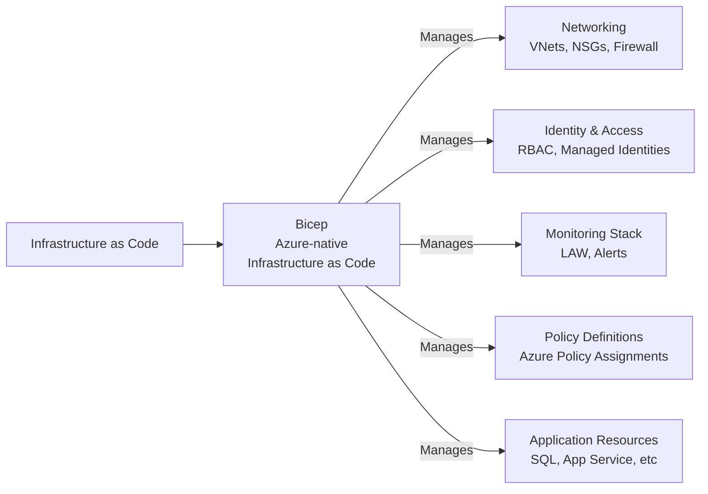

# Infrastructure as Code & Deployment Pipeline

## Overview

This document provides the complete CI/CD and Infrastructure-as-Code strategy for the banking sector landing zone using Azure-native Bicep and GitHub Actions.

## IaC Strategy

### Technology Selection



**Why Bicep for this landing zone?**
- Azure-native declarative syntax with ARM compatibility
- Cleaner and more maintainable than raw ARM JSON
- Built-in support for Azure Policy and nested deployments
- Ideal for stage-based landing zone deployment across management groups, connectivity, and project subscriptions

## Repository Structure

```
banking-infrastructure/
├── README.md
├── .github/
│   ├── workflows/
│   │   ├── validate-infrastructure.yml
│   │   ├── plan-infrastructure.yml
│   │   └── deploy-infrastructure.yml
│   └── CODEOWNERS
├── bicep/
│   ├── landing-zone/
│   │   ├── hub-vnet.bicep
│   │   ├── management-groups.bicep
│   │   ├── connectivity.bicep
│   │   └── project-spoke.bicep
│   ├── policies/
│   │   ├── banking-compliance.bicep
│   │   ├── security-hardening.bicep
│   │   └── operational-excellence.bicep
│   ├── applications/
│   │   ├── sql-database.bicep
│   │   ├── app-service.bicep
│   │   └── cosmos-db.bicep
│   └── modules/
│   ├── policies/
│   │   ├── banking-compliance.bicep
│   │   ├── security-hardening.bicep
│   │   └── operational-excellence.bicep
│   ├── applications/
│   │   ├── sql-database.bicep
│   │   ├── app-service.bicep
│   │   └── cosmos-db.bicep
│   └── modules/
│       ├── private-endpoint.bicep
│       └── diagnostic-settings.bicep
├── docs/
│   ├── ARCHITECTURE.md
│   ├── DEPLOYMENT_GUIDE.md
│   └── TROUBLESHOOTING.md
└── scripts/
    ├── validate.sh
    ├── plan.sh
    └── deploy.sh
```

## Bicep Landing Zone Modules

### Module 1: Networking

**Path**: `bicep/landing-zone/hub-vnet.bicep`

**Resources Created:**
- Hub Virtual Network with 10.19.0.0/16 address space
- Firewall subnet, Bastion subnet, Gateway subnet
- Private Endpoints subnet
- Shared Services subnet
- Management subnet
- Azure Firewall and Azure Bastion
- Private DNS zones and VNet link

**Module Inputs:**
```bicep
param location string = 'southafricanorth'
param environment string
param organizationName string
```

**Module Outputs:**
```bicep
output hubVnetId string = hubVnet.id
output firewallPrivateIp string = firewall.properties.ipConfigurations[0].properties.privateIPAddress
output privateEndpointsSubnetId string = privateEndpointsSubnet.id
output keyVaultDnsZoneId string = keyVaultDnsZone.id
```

### Module 2: Security & Identity

**Path**: `bicep/modules/security/`

**Resources Created:**
- Azure Key Vault (with Private Endpoint)
- Managed Identities
- RBAC Role Assignments
- Network Security Groups

**Key Configuration:**
```hcl
resource "azurerm_key_vault" "main" {
  name                        = local.keyvault_name
  location                    = var.location
  resource_group_name         = azurerm_resource_group.rg.name
  tenant_id                   = data.azurerm_client_config.current.tenant_id
  sku_name                    = "premium"
  enabled_for_disk_encryption = true
  enabled_for_template_deployment = true
  enabled_for_deployment      = true
  purge_protection_enabled    = true
  soft_delete_retention_days  = 90
  
  public_network_access_enabled = false

  access_policy {
    tenant_id = data.azurerm_client_config.current.tenant_id
    object_id = data.azurerm_client_config.current.object_id

    key_permissions = ["Get", "List", "Create", "Update", "Delete", "Backup", "Restore"]
    secret_permissions = ["Get", "List", "Set", "Delete"]
    certificate_permissions = ["Get", "List", "Create", "Update", "Delete"]
  }
  
  network_rules {
    default_action = "Deny"
    bypass = ["AzureServices"]
    virtual_network_subnet_ids = [azurerm_subnet.private_endpoints.id]
  }
  
  tags = local.common_tags
}

resource "azurerm_private_endpoint" "keyvault" {
  name                = "${local.keyvault_name}-pe"
  location            = var.location
  resource_group_name = azurerm_resource_group.rg.name
  subnet_id           = azurerm_subnet.private_endpoints.id

  private_service_connection {
    name                           = "${local.keyvault_name}-psc"
    private_connection_resource_id = azurerm_key_vault.main.id
    subresource_names              = ["vault"]
    is_manual_connection           = false
  }

  private_dns_zone_group {
    name                           = "${local.keyvault_name}-zonegroup"
    private_dns_zone_ids          = [azurerm_private_dns_zone.keyvault.id]
  }

  tags = local.common_tags
}
```

### Module 3: Monitoring & Logging

**Path**: `bicep/modules/monitoring/`

**Resources Created:**
- Log Analytics Workspace
- Application Insights
- Diagnostic Settings (auto-linked)
- Alert Rules
- Action Groups

**Key Configuration:**
```hcl
resource "azurerm_log_analytics_workspace" "main" {
  name                = local.law_name
  location            = var.location
  resource_group_name = azurerm_resource_group.rg.name
  sku                 = "PerGB2018"
  retention_in_days   = 730

  public_network_access_for_ingestion    = "Disabled"
  public_network_access_for_query        = "Disabled"
  immediate_purge_data_on_30_days        = false
  daily_quota_gb                         = 10

  data_collection_rule_id = azurerm_monitor_data_collection_rule.dcr.id

  tags = local.common_tags
}

resource "azurerm_private_endpoint" "law" {
  name                = "${local.law_name}-pe"
  location            = var.location
  resource_group_name = azurerm_resource_group.rg.name
  subnet_id           = azurerm_subnet.private_endpoints.id

  private_service_connection {
    name                           = "${local.law_name}-psc"
    private_connection_resource_id = azurerm_log_analytics_workspace.main.id
    subresource_names              = ["Data_Ingestion_and_Query_API"]
    is_manual_connection           = false
  }

  private_dns_zone_group {
    name                           = "${local.law_name}-zonegroup"
    private_dns_zone_ids          = [azurerm_private_dns_zone.law.id]
  }

  tags = local.common_tags
}
```

## GitHub Actions Workflows

### Workflow 1: Validate Infrastructure

**File**: `.github/workflows/validate-infrastructure.yml`

```yaml
name: Validate Infrastructure

on:
  pull_request:
    paths:
      - 'bicep/**'
      - '.github/workflows/validate-infrastructure.yml'

jobs:
  bicep-validate:
    runs-on: [self-hosted, private-network]
    steps:
      - name: Checkout code
        uses: actions/checkout@v4

      - name: Azure Login
        uses: azure/login@v1
        with:
          client-id: ${{ secrets.AZURE_CLIENT_ID }}
          tenant-id: ${{ secrets.AZURE_TENANT_ID }}
          subscription-id: ${{ secrets.AZURE_SUBSCRIPTION_ID }}

      - name: Validate Bicep Files
        run: |
          az bicep build --file bicep/landing-zone/hub-vnet.bicep
          az bicep build --file bicep/policies/banking-compliance.bicep
          az bicep build --file bicep/landing-zone/project-spoke.bicep

      - name: Comment PR with Results
        if: failure()
        uses: actions/github-script@v7
        with:
          script: |
            github.rest.issues.createComment({
              issue_number: context.issue.number,
              owner: context.repo.owner,
              repo: context.repo.repo,
              body: '❌ Infrastructure validation failed. Check logs for details.'
            })

      - name: Comment PR with Results
        if: failure()
        uses: actions/github-script@v7
        with:
          script: |
            github.rest.issues.createComment({
              issue_number: context.issue.number,
              owner: context.repo.owner,
              repo: context.repo.repo,
              body: '❌ Infrastructure validation failed. Check logs for details.'
            })
```

### Workflow 2: Plan Infrastructure

**File**: `.github/workflows/plan-infrastructure.yml`

```yaml
name: Plan Infrastructure

on:
  pull_request:
    paths:
      - 'bicep/**'

env:
  ARM_CLIENT_ID: ${{ secrets.AZURE_CLIENT_ID }}
  ARM_CLIENT_SECRET: ${{ secrets.AZURE_CLIENT_SECRET }}
  ARM_SUBSCRIPTION_ID: ${{ secrets.AZURE_SUBSCRIPTION_ID }}
  ARM_TENANT_ID: ${{ secrets.AZURE_TENANT_ID }}

jobs:
  plan:
    runs-on: [self-hosted, private-network]
    strategy:
      matrix:
        stage: [management, connectivity, project]
        environment: [dev, staging]
    steps:
      - name: Checkout code
        uses: actions/checkout@v4

      - name: Azure Login
        uses: azure/login@v1
        with:
          client-id: ${{ secrets.AZURE_CLIENT_ID }}
          tenant-id: ${{ secrets.AZURE_TENANT_ID }}
          subscription-id: ${{ secrets.AZURE_SUBSCRIPTION_ID }}

      - name: Build Bicep
        run: |
          if [ "${{ matrix.stage }}" = "management" ]; then
            az bicep build --file bicep/landing-zone/management-groups.bicep
          elif [ "${{ matrix.stage }}" = "connectivity" ]; then
            az bicep build --file bicep/landing-zone/hub-vnet.bicep
          else
            az bicep build --file bicep/landing-zone/project-spoke.bicep
          fi

      - name: Deployment What-If
        run: |
          if [ "${{ matrix.stage }}" = "management" ]; then
            az deployment sub what-if --location southafricanorth --template-file bicep/landing-zone/management-groups.json
          elif [ "${{ matrix.stage }}" = "connectivity" ]; then
            az deployment group what-if --resource-group rg-hub-${{ matrix.environment }} --template-file bicep/landing-zone/hub-vnet.json
          else
            az deployment group what-if --resource-group rg-project-${{ matrix.environment }} --template-file bicep/landing-zone/project-spoke.json
          fi

      - name: Upload What-If Artifact
        uses: actions/upload-artifact@v3
        with:
          name: whatif-${{ matrix.stage }}-${{ matrix.environment }}
          path: '*.json'
          retention-days: 7

      - name: Comment PR with What-If Summary
        uses: actions/github-script@v7
        with:
          script: |
            github.rest.issues.createComment({
              issue_number: context.issue.number,
              owner: context.repo.owner,
              repo: context.repo.repo,
              body: `## Bicep What-If - ${{ matrix.stage }} / ${{ matrix.environment }}\nArtifacts uploaded.`
            })
```

### Workflow 3: Deploy Infrastructure

**File**: `.github/workflows/deploy-infrastructure.yml`

```yaml
name: Deploy Infrastructure

on:
  push:
    branches:
      - main
    paths:
      - 'bicep/**'

env:
  ARM_CLIENT_ID: ${{ secrets.AZURE_CLIENT_ID }}
  ARM_CLIENT_SECRET: ${{ secrets.AZURE_CLIENT_SECRET }}
  ARM_SUBSCRIPTION_ID: ${{ secrets.AZURE_SUBSCRIPTION_ID }}
  ARM_TENANT_ID: ${{ secrets.AZURE_TENANT_ID }}

jobs:
  deploy-management:
    runs-on: [self-hosted, private-network]
    environment: production
    steps:
      - name: Checkout code
        uses: actions/checkout@v4

      - name: Azure Login
        uses: azure/login@v1
        with:
          client-id: ${{ secrets.AZURE_CLIENT_ID }}
          tenant-id: ${{ secrets.AZURE_TENANT_ID }}
          subscription-id: ${{ secrets.AZURE_SUBSCRIPTION_ID }}

      - name: Deploy Management Groups
        run: |
          az deployment sub create \
            --location southafricanorth \
            --template-file bicep/landing-zone/management-groups.json

  deploy-connectivity:
    needs: deploy-management
    runs-on: [self-hosted, private-network]
    environment: production
    steps:
      - name: Checkout code
        uses: actions/checkout@v4

      - name: Azure Login
        uses: azure/login@v1
        with:
          client-id: ${{ secrets.AZURE_CLIENT_ID }}
          tenant-id: ${{ secrets.AZURE_TENANT_ID }}
          subscription-id: ${{ secrets.AZURE_SUBSCRIPTION_ID }}

      - name: Deploy Hub Connectivity
        run: |
          az deployment group create \
            --resource-group rg-hub-prod \
            --template-file bicep/landing-zone/hub-vnet.json

  deploy-projects:
    needs: deploy-connectivity
    runs-on: [self-hosted, private-network]
    environment: production
    strategy:
      matrix:
        project: [project-a, project-b]
    steps:
      - name: Checkout code
        uses: actions/checkout@v4

      - name: Azure Login
        uses: azure/login@v1
        with:
          client-id: ${{ secrets.AZURE_CLIENT_ID }}
          tenant-id: ${{ secrets.AZURE_TENANT_ID }}
          subscription-id: ${{ secrets.AZURE_SUBSCRIPTION_ID }}

      - name: Deploy Project Spokes
        run: |
          az deployment group create \
            --resource-group rg-${{ matrix.project }}-prod \
            --template-file bicep/landing-zone/project-spoke.json

  notify:
    needs: [deploy-management, deploy-connectivity, deploy-projects]
    runs-on: [self-hosted, private-network]
    steps:
      - name: Notify Deployment Result
        uses: actions/github-script@v7
        with:
          script: |
            github.rest.issues.createComment({
              issue_number: context.issue.number,
              owner: context.repo.owner,
              repo: context.repo.repo,
              body: '✅ Bicep landing zone deployment pipeline completed successfully.'
            })
```

## Self-Hosted Runner Configuration

### Runner Setup Script

```bash
#!/bin/bash

# Install dependencies
sudo apt-get update
sudo apt-get install -y \
  curl \
  git \
  jq \
  python3-pip \
  unzip

# Install Azure CLI
curl -sL https://aka.ms/InstallAzureCLIDeb | sudo bash

# Install Bicep
az bicep install

# Install GitHub Actions Runner
mkdir actions-runner
cd actions-runner

curl -o actions-runner-linux-x64-2.310.0.tar.gz \
  -L https://github.com/actions/runner/releases/download/v2.310.0/actions-runner-linux-x64-2.310.0.tar.gz

tar xzf ./actions-runner-linux-x64-2.310.0.tar.gz

# Configure runner with GitHub token
./config.sh --url https://github.com/banking-org/banking-infrastructure \
  --token {REGISTRATION_TOKEN} \
  --labels "self-hosted,private-network" \
  --name "runner-banking-prod"

# Install runner as service
sudo ./svc.sh install
sudo ./svc.sh start
```

### Runner Security Configuration

**Managed Identity Assignment:**
```bash
# Assign system-managed identity to runner VM
az vm identity assign --resource-group rg-banking-prod \
  --name vm-github-runner

# Grant Key Vault access
az keyvault set-policy --name kv-banking-prod \
  --resource-group rg-banking-prod \
  --object-id <managed-identity-object-id> \
  --secret-permissions get list \
  --key-permissions get list
```

## Secrets Management

### GitHub Secrets Configuration

```
AZURE_CLIENT_ID              // Service Principal App ID
AZURE_CLIENT_SECRET          // Service Principal Secret (prefer managed identity)
AZURE_SUBSCRIPTION_ID        // Azure Subscription ID
AZURE_TENANT_ID              // Azure Tenant ID
```

### Azure Key Vault Integration

```yaml
steps:
  - name: Get Secrets from Key Vault
    run: |
      DATABASE_PASSWORD=$(az keyvault secret show \
        --vault-name kv-banking-prod \
        --name db-password \
        --query value -o tsv)
      echo "::add-mask::$DATABASE_PASSWORD"
      echo "DATABASE_PASSWORD=$DATABASE_PASSWORD" >> $GITHUB_ENV
```

---

**Document Version**: 1.0  
**Last Updated**: June 2026
