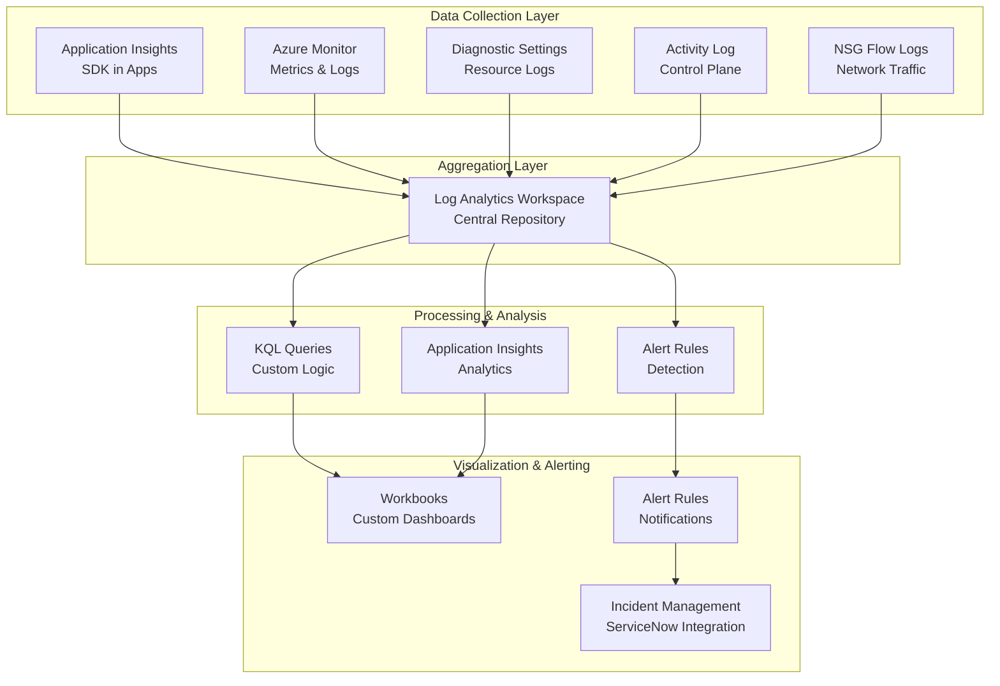

# Monitoring & Observability as Code

## Overview

This document details the monitoring architecture using Azure-native tools with Infrastructure-as-Code for dashboards, alerts, and observability.

## Monitoring Architecture



## Log Analytics Workspace Configuration

### Workspace Settings

```json
{
  "name": "law-banking-prod-southafricanorth",
  "location": "southafricanorth",
  "sku": "PerGB2018",
  "retentionInDays": 730,
  "features": {
    "enableLogAccessUsingOnlyResourcePermissions": true,
    "immediatePurgeDataOn30Days": false
  },
  "publicNetworkAccessForIngestion": "Disabled",
  "publicNetworkAccessForQuery": "Disabled",
  "tags": {
    "Environment": "Production",
    "Project": "Platform",
    "Owner": "platform-team@banking.com",
    "DataClassification": "Confidential"
  }
}
```

### Data Sources Configuration

**1. Application Insights Connection:**
```
Connect all Application Insights instances to central LAW
- Configure via Diagnostic Settings
- Default tables:
  - AppTraces
  - AppEvents
  - AppExceptions
  - AppMetrics
```

**2. Azure Monitor Metrics:**
```
Metrics from resources:
- Virtual Machine CPU, Memory, Disk I/O
- App Service CPU, Memory, Requests
- SQL Database DTU, CPU, I/O
- Azure Firewall throughput, rules hit
```

**3. Diagnostic Settings (Resource Logs):**
```
Enable for:
- App Service: AppServiceConsoleLogs, AppServiceAppLogs
- Key Vault: AuditEvent
- SQL Database: SQLSecurityAuditEvents, SQLInsights
- Storage Account: StorageRead, StorageWrite, StorageDelete
- Network Security Groups: NetworkSecurityGroupEvent, NetworkSecurityGroupRuleCounter
- Azure Firewall: AzureFirewallApplicationRule, AzureFirewallNetworkRule
```

**4. Activity Log (Control Plane):**
```
Collection: Administrative, Security, Service Health events
Retention: 90 days in activity log, then LAW
Key events:
- Resource creation/deletion
- Policy changes
- Role assignments
- Access changes
```

## Custom Tables & Ingestion

### Custom Table: Banking Transactions

For banking applications to ingest transaction logs:

```kusto
// Custom table schema
custom_banking_transactions
| extend 
    TransactionId = string,
    CustomerId = string,
    Amount = decimal,
    Currency = string,
    TransactionType = string,  // Debit, Credit, Transfer
    Status = string,            // Success, Failed, Pending
    Timestamp = datetime,
    ProcessingTimeMs = int,
    SourceAccount = string,
    DestinationAccount = string,
    RiskScore = int
```

**Data Ingestion Methods:**
1. Application Insights Custom Events (low volume)
2. Azure Monitor Logs API (medium volume)
3. Data Collector API (high volume - batch)

## KQL Queries for Monitoring

### 1. Performance Monitoring

**Application Response Time Alert:**
```kusto
AppRequests
| where TimeGenerated > ago(15m)
| summarize AvgResponseTime = avg(DurationMs), 
            Count = count(),
            P95ResponseTime = percentile(DurationMs, 95)
            by AppName, OperationName
| where AvgResponseTime > 2000  // 2 seconds
| project-reorder AppName, OperationName, AvgResponseTime, P95ResponseTime
```

**Database Query Performance:**
```kusto
AzureDiagnostics
| where ResourceType == "SERVERS" and Category == "QueryStoreWaitStatistics"
| summarize AvgDurationMs = avg(query_wait_time_ms),
            MaxDurationMs = max(query_wait_time_ms),
            Count = count()
            by DatabaseName, query_text
| where AvgDurationMs > 5000
| top 10 by AvgDurationMs desc
```

**Memory and CPU Usage:**
```kusto
Perf
| where TimeGenerated > ago(1h)
| where (ObjectName == "Processor" and CounterName == "% Processor Time") or
        (ObjectName == "Memory" and CounterName == "% Committed Bytes In Use")
| summarize AvgUsage = avg(CounterValue),
            MaxUsage = max(CounterValue)
            by Computer, ObjectName, CounterName
| where AvgUsage > 80
```

### 2. Security Monitoring

**Failed Authentication Attempts:**
```kusto
AuditLogs
| where OperationName == "Sign-in activity"
| where Result == "failure"
| where TimeGenerated > ago(5m)
| summarize FailureCount = count() by UserPrincipalName, IPAddress, FailureReason
| where FailureCount >= 5
| project Alert = "Multiple Failed Logins", 
          User = UserPrincipalName,
          IP = IPAddress,
          Failures = FailureCount
```

**Unauthorized API Calls:**
```kusto
AppRequests
| where TimeGenerated > ago(15m)
| where ResponseCode == 401 or ResponseCode == 403
| summarize UnauthorizedCount = count() by UserIdentity, OperationName, ResponseCode
| where UnauthorizedCount > 10
| project Alert = "Unauthorized API Access", 
          User = UserIdentity,
          Operation = OperationName,
          Count = UnauthorizedCount
```

**Policy Violations:**
```kusto
AzureActivity
| where TimeGenerated > ago(1h)
| where ActivityStatus == "Failure" and OperationNameValue has "policyviolation"
| summarize ViolationCount = count() by Caller, ResourceGroup, _ResourceId
| project Alert = "Policy Violation",
          Caller = Caller,
          ResourceGroup = ResourceGroup,
          Count = ViolationCount
```

**Public Endpoint Detection:**
```kusto
AzureActivity
| where TimeGenerated > ago(1h)
| where OperationNameValue == "Microsoft.Sql/servers/firewallRules/write"
| where tostring(parse_json(Properties).requestbody) contains "0.0.0.0"
| project Alert = "Public Firewall Rule Created",
          Caller = Caller,
          SQL_Server = _ResourceId,
          Timestamp = TimeGenerated
```

### 3. Compliance Monitoring

**Unencrypted Data Transfers:**
```kusto
AppRequests
| where TimeGenerated > ago(1h)
| where parse_url(Url).Scheme != "https"
| summarize Count = count() by AppName, Url, Client_Type
| project Alert = "Unencrypted Data Transfer",
          Application = AppName,
          Endpoint = Url,
          Count = Count
```

**Missing Audit Logs:**
```kusto
AzureDiagnostics
| where TimeGenerated > ago(24h)
| where Category in ("AuditEvent", "SQLSecurityAuditEvents")
| summarize LastLogTime = max(TimeGenerated) by ResourceId
| where ago(24h) > LastLogTime
| project Alert = "Audit Logging Disabled",
          Resource = ResourceId,
          LastLogTime = LastLogTime
```

**Disabled Encryption:**
```kusto
AzureActivity
| where TimeGenerated > ago(1h)
| where OperationNameValue has "EncryptionProtectors/write" or
        OperationNameValue has "TransparentDataEncryption/write"
| where parse_json(Properties).statusCode == "200"
| project Alert = "Encryption Configuration Changed",
          Resource = _ResourceId,
          Operation = OperationNameValue,
          Caller = Caller
```

### 4. Operational Monitoring

**Service Availability:**
```kusto
AppAvailabilityResults
| where TimeGenerated > ago(5m)
| summarize SuccessCount = countif(Success == true),
            FailureCount = countif(Success == false),
            Availability = (todouble(countif(Success == true)) / count()) * 100
            by TestName, Location
| where Availability < 99
| project Alert = "Low Service Availability",
          TestName = TestName,
          Location = Location,
          AvailabilityPercent = round(Availability, 2)
```

**Deployment Failures:**
```kusto
AzureActivity
| where TimeGenerated > ago(1h)
| where ActivityStatus == "Failure" and 
        (OperationNameValue has "deploy" or 
         OperationNameValue has "create" or
         OperationNameValue has "write")
| summarize FailureCount = count() by ResourceType, OperationNameValue, ResourceGroup
| where FailureCount >= 1
| project Alert = "Deployment Failed",
          ResourceType = ResourceType,
          Operation = OperationNameValue,
          ResourceGroup = ResourceGroup
```

## Alert Rules Configuration

### Alert Rule 1: High CPU Usage

```json
{
  "name": "alert-high-cpu-usage",
  "description": "Alert when CPU usage exceeds 85%",
  "severity": 2,
  "enabled": true,
  "scopes": ["/subscriptions/{sub-id}/resourceGroups/rg-projecta-prod"],
  "evaluationFrequency": "PT5M",
  "windowSize": "PT15M",
  "criteria": {
    "allOf": [
      {
        "query": "Perf | where ObjectName == 'Processor' and CounterName == '% Processor Time' | summarize AvgCPU = avg(CounterValue) by Computer",
        "operator": "GreaterThan",
        "threshold": 85,
        "timeAggregation": "Average"
      }
    ]
  },
  "actions": [
    {
      "actionGroupId": "/subscriptions/{sub-id}/resourceGroups/rg-monitoring/providers/microsoft.insights/actionGroups/ag-oncall",
      "webhook": {
        "properties": {}
      }
    }
  ]
}
```

### Alert Rule 2: Authentication Failures

```json
{
  "name": "alert-auth-failures",
  "description": "Alert on 5+ failed login attempts in 5 minutes",
  "severity": 1,
  "enabled": true,
  "criteria": {
    "allOf": [
      {
        "query": "AuditLogs | where OperationName == 'Sign-in activity' and Result == 'failure' | summarize Count = count() by UserPrincipalName",
        "operator": "GreaterThanOrEqual",
        "threshold": 5,
        "timeAggregation": "Total"
      }
    ]
  },
  "actions": [
    {
      "actionGroupId": "/subscriptions/{sub-id}/resourceGroups/rg-monitoring/providers/microsoft.insights/actionGroups/ag-security"
    }
  ]
}
```

### Alert Rule 3: Service Availability

```json
{
  "name": "alert-low-availability",
  "description": "Alert when availability drops below 99%",
  "severity": 1,
  "enabled": true,
  "evaluationFrequency": "PT5M",
  "windowSize": "PT30M",
  "criteria": {
    "allOf": [
      {
        "query": "AppAvailabilityResults | summarize Availability = (todouble(countif(Success == true)) / count()) * 100",
        "operator": "LessThan",
        "threshold": 99
      }
    ]
  }
}
```

## Monitoring Dashboards

### Dashboard 1: Operational Excellence

**Dashboard Name**: `Banking-Operations-Dashboard`

**Key Metrics:**
- Application Health (Status)
- Response Time (P95, P99)
- Error Rate
- Request Throughput
- Database Performance
- Network Latency
- Resource Utilization (CPU, Memory)
- Deployment Status

### Dashboard 2: Security & Compliance

**Dashboard Name**: `Banking-Security-Dashboard`

**Key Metrics:**
- Failed Authentication Attempts
- Policy Violations
- Public Endpoints Detected
- Unencrypted Communications
- Audit Log Health
- Access Changes
- Firewall Rule Changes
- Network Security Events

### Dashboard 3: Cost & Performance

**Dashboard Name**: `Banking-Cost-Dashboard`

**Key Metrics:**
- Daily Spend by Project
- Monthly Trend
- Resource Utilization Efficiency
- Reserved Instance Coverage
- Idle Resources
- Cost by Service Type
- Cost Anomalies
- Budget vs. Actual

## Workbook Templates

### Workbook 1: Application Performance

```json
{
  "version": "Notebook/1.0",
  "items": [
    {
      "type": 1,
      "content": {
        "json": "# Application Performance Monitoring"
      }
    },
    {
      "type": 3,
      "content": {
        "version": "KqlItem/1.0",
        "query": "AppRequests | where TimeGenerated > ago(24h) | summarize AvgResponseTime = avg(DurationMs), P95 = percentile(DurationMs, 95), P99 = percentile(DurationMs, 99) by AppName, bin(TimeGenerated, 1h)",
        "visualization": "timechart"
      }
    }
  ]
}
```

### Workbook 2: Security Events

```json
{
  "version": "Notebook/1.0",
  "items": [
    {
      "type": 1,
      "content": {
        "json": "# Security Events Monitoring"
      }
    },
    {
      "type": 3,
      "content": {
        "query": "AuditLogs | where TimeGenerated > ago(7d) | where Result == 'failure' | summarize Count = count() by UserPrincipalName, OperationName",
        "visualization": "barchart"
      }
    }
  ]
}
```

## Action Groups Configuration

### Action Group 1: On-Call Team

```json
{
  "name": "ag-oncall",
  "groupShortName": "oncall",
  "enabled": true,
  "receivers": [
    {
      "name": "PagerDuty",
      "webhookReceiver": {
        "name": "pagerduty",
        "serviceUri": "https://events.pagerduty.com/integration/{integration-key}/enqueue"
      }
    },
    {
      "name": "Email-NotificationList",
      "emailReceiver": {
        "name": "ops-team",
        "emailAddress": "ops-team@banking.com"
      }
    }
  ]
}
```

### Action Group 2: Security Team

```json
{
  "name": "ag-security",
  "groupShortName": "security",
  "enabled": true,
  "receivers": [
    {
      "name": "Slack-Security",
      "webhookReceiver": {
        "name": "slack",
        "serviceUri": "https://hooks.slack.com/services/{workspace}/{channel}/{token}"
      }
    },
    {
      "name": "Email-SecurityTeam",
      "emailReceiver": {
        "name": "security-team",
        "emailAddress": "security-team@banking.com"
      }
    }
  ]
}
```

## SLA & Target Metrics

| Metric | Target | Priority |
|--------|--------|----------|
| Application Availability | 99.9% | Critical |
| Average Response Time | < 1 second | High |
| Database Performance | < 100ms p95 | High |
| Security Event Response | < 15 minutes | Critical |
| Deployment Success Rate | > 95% | Medium |
| Log Ingestion Latency | < 2 minutes | Medium |

---

**Document Version**: 1.0  
**Last Updated**: June 2026
