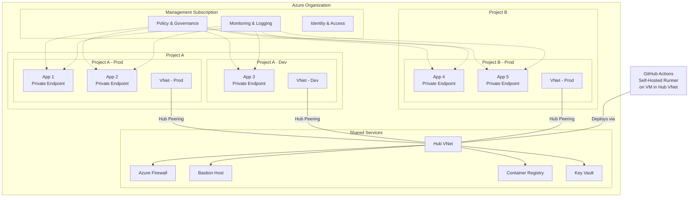
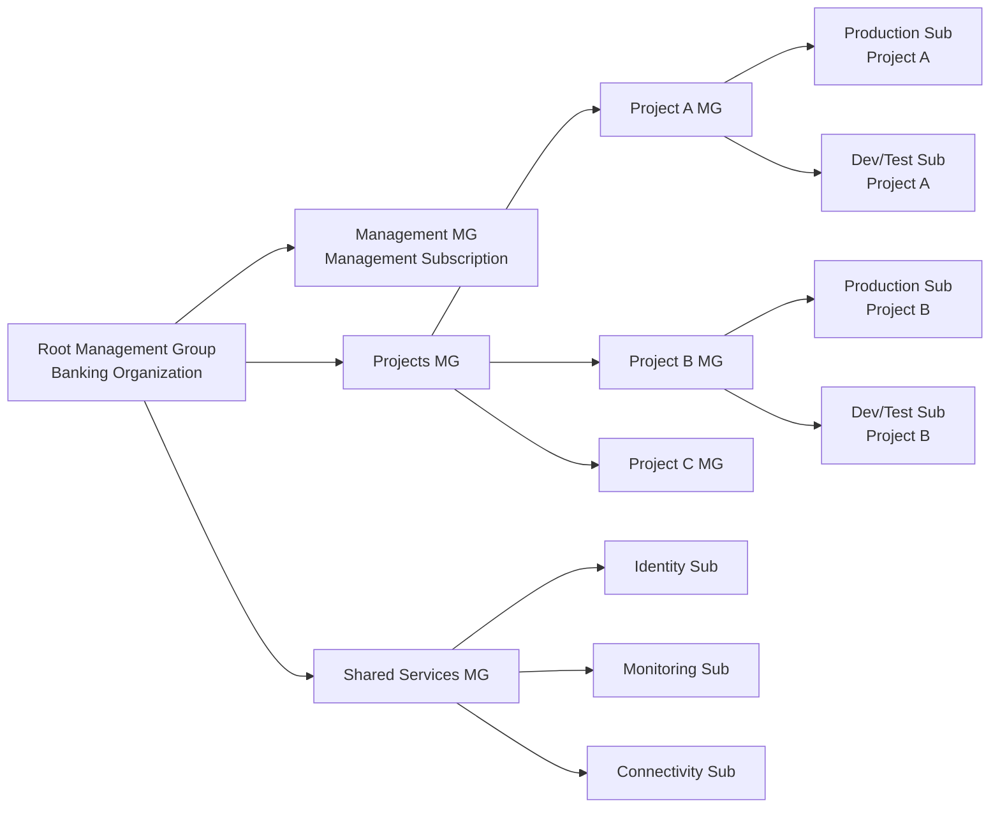
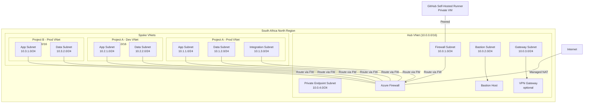
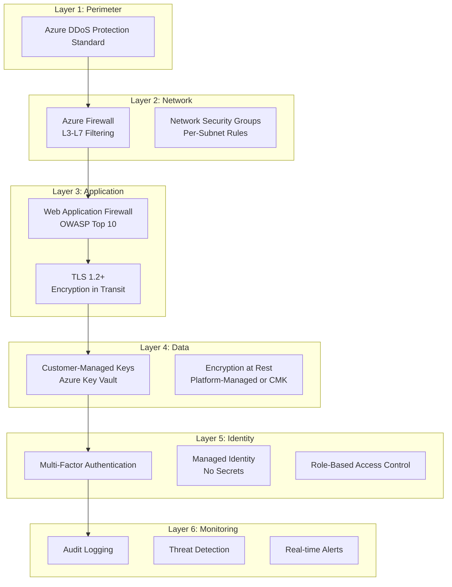
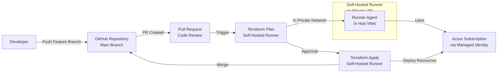
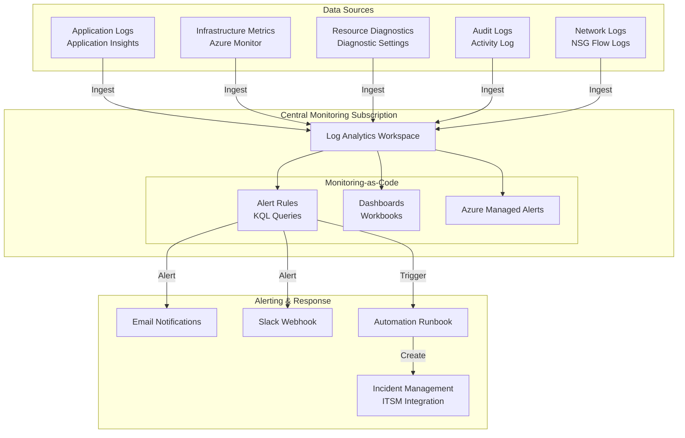
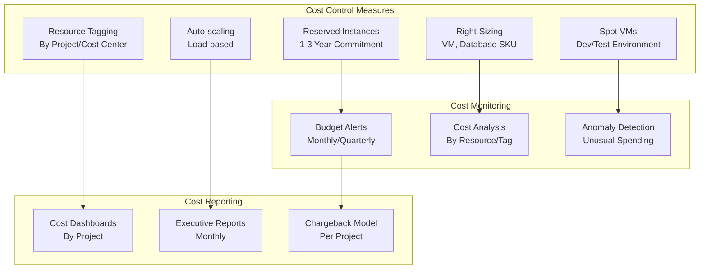
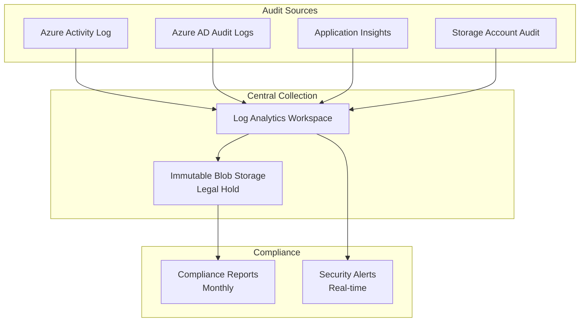

# Banking Sector Customer Landing Zone Design

## Executive Summary

This document provides a comprehensive design for an Azure landing zone tailored for the banking sector with support for multiple projects and applications. The design emphasizes centralized governance, security, operational excellence, and compliance requirements critical for financial institutions.

**Key Characteristics:**
- **Region**: South Africa North
- **Multi-tenancy Model**: Organization with multiple projects, each containing multiple applications
- **Security**: Private endpoints, network isolation, and zero-trust principles
- **Governance**: Policy-as-Code and centralized governance
- **Operations**: Azure-native tools with monitoring-as-code
- **Deployment**: GitHub-based CI/CD with Infrastructure-as-Code (Terraform/Bicep)
- **Compliance**: Banking sector requirements with audit trails

## Table of Contents
1. [Architecture Overview](#architecture-overview)
2. [Organizational Structure](#organizational-structure)
3. [Network Architecture](#network-architecture)
4. [Security & Compliance](#security-compliance)
5. [Governance Framework](#governance-framework)
6. [Deployment Pipeline](#deployment-pipeline)
7. [Monitoring & Observability](#monitoring-observability)
8. [Cost Management](#cost-management)
9. [Implementation Roadmap](#implementation-roadmap)

---

## Architecture Overview

### High-Level Architecture Diagram



### Key Design Principles

| Principle | Implementation |
|-----------|-----------------|
| **Zero Trust** | Private endpoints, network isolation, managed identities |
| **Centralized Control** | Shared services in hub, policy enforcement at root |
| **Defense in Depth** | Firewall, NSGs, Private Link, encryption in transit |
| **Compliance First** | Audit logging, immutable logs, policy-as-code |
| **Cost Optimization** | Resource tagging, reserved capacity, cost monitoring |
| **Operational Excellence** | Infrastructure-as-Code, monitoring-as-code, automation |

---

## Organizational Structure

### Subscription Layout



### RBAC Strategy

**Management Group Hierarchy:**

```
Root (Banking Organization)
├── Management
│   ├── Policy & Governance Team
│   ├── Platform Engineers
│   └── Security Team
├── Projects
│   ├── Project A
│   │   ├── Project Owner (Owner)
│   │   ├── App Owners (Contributor)
│   │   └── Developers (Reader + Custom roles)
│   ├── Project B
│   └── Project C
└── Shared Services
    ├── Identity Admins (Owner)
    ├── Monitoring Admins (Owner)
    └── Network Admins (Owner)
```

---

## Network Architecture

### Network Design



### Private Endpoint Strategy

**Private Endpoints for:**
- Azure SQL Database
- Azure Cosmos DB
- Azure Storage (Blob, Queue, Table)
- Azure Key Vault
- Azure Container Registry
- Azure Service Bus
- Azure App Configuration
- Azure Cognitive Services

**Benefits:**
- Eliminates exposure to public internet
- DNS resolution via Private DNS Zones
- Audit trail via Network Security Groups

---

## Security & Compliance

### Defense in Depth Layers



### Encryption Strategy

**Data at Rest:**
- SQL Database: Transparent Data Encryption (TDE) with CMK
- Storage Accounts: Storage Service Encryption (SSE) with CMK
- Application Secrets: Azure Key Vault with HSM-backed keys
- Disks: Azure Disk Encryption

**Data in Transit:**
- Minimum TLS 1.2
- Private endpoints (no internet routing)
- Managed identities (no credentials in transit)

**Key Management:**
- Azure Key Vault with Private Endpoint
- Key rotation every 90 days
- Audit logging of all key operations

---

## Governance Framework

### Policy-as-Code Strategy

**Azure Policy Initiatives:**

1. **Mandatory Policies**
   - Private endpoints required for PaaS services
   - Encryption at rest mandatory
   - Audit logging enabled
   - Network security groups required
   - No public IP addresses for databases

2. **Compliance Policies**
   - Allowed locations: South Africa North only
   - Allowed resource types (whitelist)
   - Allowed SKUs (cost control)
   - Tags required (6 mandatory tags)
   - Immutable backups required

3. **Operational Policies**
   - Monitoring must be enabled
   - Diagnostic settings mandatory
   - MFA required for user access
   - Auto-shutdown for dev resources

**Mandatory Tags:**
- `Environment` (Production, Staging, Development)
- `Project` (Project A, B, C)
- `Owner` (Email)
- `CostCenter` (Finance code)
- `ApplicationName` (Application identifier)
- `DataClassification` (Public, Internal, Confidential, Restricted)

---

## Deployment Pipeline

### GitHub-Based CI/CD Architecture



### GitHub Actions Self-Hosted Runner Configuration

**Runner VM Specifications:**
- Location: Hub VNet (no public IP)
- VM Size: Standard_D4s_v3 (minimum)
- Authentication: System-assigned managed identity
- Network: Private endpoint access only

**Secrets Management:**
- GitHub Secrets: Repository secrets encrypted
- Azure Key Vault: Sensitive data stored
- Managed Identity: No credentials needed

**GitHub Actions Workflow:**

```yaml
# .github/workflows/deploy-infrastructure.yml
name: Deploy Infrastructure

on:
  pull_request:
    paths:
      - 'infrastructure/**'
  push:
    branches:
      - main
    paths:
      - 'infrastructure/**'

env:
  TERRAFORM_VERSION: 1.5.0
  AZURE_REGION: southafricanorth

jobs:
  plan:
    runs-on: [self-hosted, private-network]
    steps:
      - uses: actions/checkout@v3
      
      - name: Azure Login
        uses: azure/login@v1
        with:
          client-id: ${{ secrets.AZURE_CLIENT_ID }}
          tenant-id: ${{ secrets.AZURE_TENANT_ID }}
          subscription-id: ${{ secrets.AZURE_SUBSCRIPTION_ID }}
          
      - name: Terraform Init
        run: terraform init
        working-directory: infrastructure
        
      - name: Terraform Plan
        run: terraform plan -out=tfplan
        working-directory: infrastructure
        
      - name: Upload Plan
        uses: actions/upload-artifact@v3
        with:
          name: tfplan
          path: infrastructure/tfplan

  apply:
    if: github.ref == 'refs/heads/main'
    needs: plan
    runs-on: [self-hosted, private-network]
    environment: production
    steps:
      - uses: actions/checkout@v3
      
      - name: Azure Login
        uses: azure/login@v1
        with:
          client-id: ${{ secrets.AZURE_CLIENT_ID }}
          tenant-id: ${{ secrets.AZURE_TENANT_ID }}
          subscription-id: ${{ secrets.AZURE_SUBSCRIPTION_ID }}
          
      - name: Download Plan
        uses: actions/download-artifact@v3
        with:
          name: tfplan
          path: infrastructure
          
      - name: Terraform Apply
        run: terraform apply -auto-approve tfplan
        working-directory: infrastructure
```

---

## Monitoring & Observability

### Monitoring Architecture



### Key Monitoring Scenarios

**1. Performance Monitoring**
- Application response time > 2 seconds
- Error rate > 1%
- Database query duration > 5 seconds
- Memory usage > 80%

**2. Security Monitoring**
- Failed authentication attempts (threshold: 5 in 5 minutes)
- Unauthorized API calls
- Policy violations
- Data exfiltration attempts

**3. Compliance Monitoring**
- Unencrypted data transfers
- Public endpoints detected
- Missing required tags
- Disabled logging

**4. Operational Monitoring**
- Service availability < 99%
- Deployment failures
- Configuration drift
- Resource quota utilization

### Monitoring-as-Code Templates

**Alert Query Example (KQL):**
```kusto
AppServicePlanMetrics
| where TimeGenerated > ago(15m)
| where Metric == "CpuPercentage"
| where Average > 80
| summarize by ResourceName, ResourceGroup
| project Alert="High CPU Usage", Resource=ResourceName, CpuAverage=Average
```

**Dashboard Workbook:**
- Cost trends (last 30 days)
- Resource performance metrics
- Compliance status
- Security events

---

## Cost Management

### Cost Optimization Strategy



### Budget Controls

| Budget Level | Owner | Alert Threshold |
|-------------|-------|-----------------|
| Organization | CFO | 80% of budget |
| Management Group | Finance | 75% of budget |
| Project | Project Owner | 70% of budget |
| Subscription | Subscription Owner | 60% of budget |

---

## Implementation Roadmap

### Phase 1: Foundation (Months 1-2)
- [ ] Set up Management Groups and subscriptions
- [ ] Implement identity and access management (Azure AD)
- [ ] Deploy hub VNet and firewall
- [ ] Set up monitoring infrastructure (Log Analytics)
- [ ] Implement baseline Azure Policies

**Deliverables:**
- Management Group structure
- RBAC configuration
- Network foundation

### Phase 2: Security & Compliance (Months 2-3)
- [ ] Deploy Private Link endpoints
- [ ] Implement encryption (CMK, TDE)
- [ ] Set up audit logging
- [ ] Create policy-as-code framework
- [ ] Deploy Key Vault with HSM

**Deliverables:**
- Security policies
- Compliance framework
- Key management

### Phase 3: Operational Excellence (Months 3-4)
- [ ] Deploy self-hosted GitHub runner
- [ ] Implement Infrastructure-as-Code templates
- [ ] Set up monitoring-as-code (Terraform)
- [ ] Create deployment pipelines
- [ ] Implement cost management

**Deliverables:**
- IaC templates
- CI/CD pipelines
- Monitoring dashboards

### Phase 4: Project Onboarding (Months 4-5)
- [ ] Onboard Project A
- [ ] Onboard Project B
- [ ] Onboard additional projects
- [ ] Fine-tune policies and alerts
- [ ] Documentation and training

**Deliverables:**
- Project subscriptions
- Application deployments
- Training materials

### Phase 5: Optimization (Months 5-6)
- [ ] Performance tuning
- [ ] Cost optimization
- [ ] Policy refinement
- [ ] Disaster recovery planning (backups only)
- [ ] Knowledge transfer

**Deliverables:**
- Optimization report
- Best practices guide
- Operations runbook

---

## Compliance & Audit Trail

### Audit Logging Strategy



### Audit Log Retention
- Azure Activity Logs: 90 days (then LAW)
- Log Analytics: 2 years
- Immutable Storage: 7 years (for compliance)

---

## Contact & Support

**For questions or clarifications on this design, contact:**
- **Architecture Review Board**: [email]
- **Platform Engineering Team**: [email]
- **Security & Compliance**: [email]

---

**Document Version**: 1.0  
**Last Updated**: June 2026  
**Review Frequency**: Quarterly
