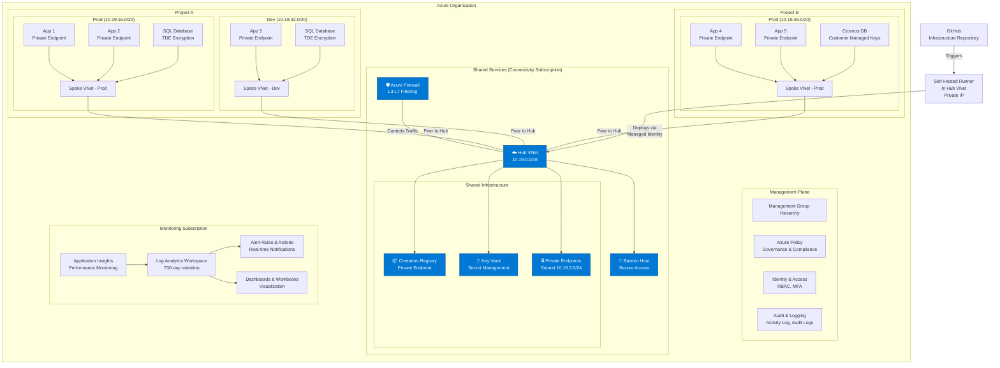
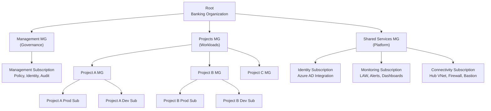
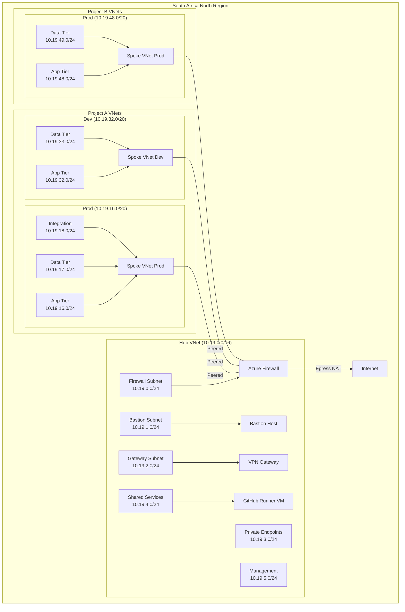
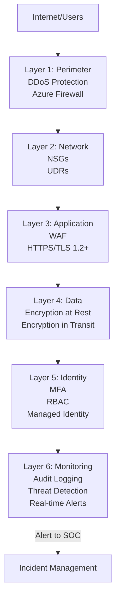
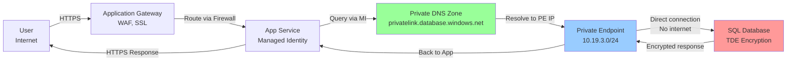
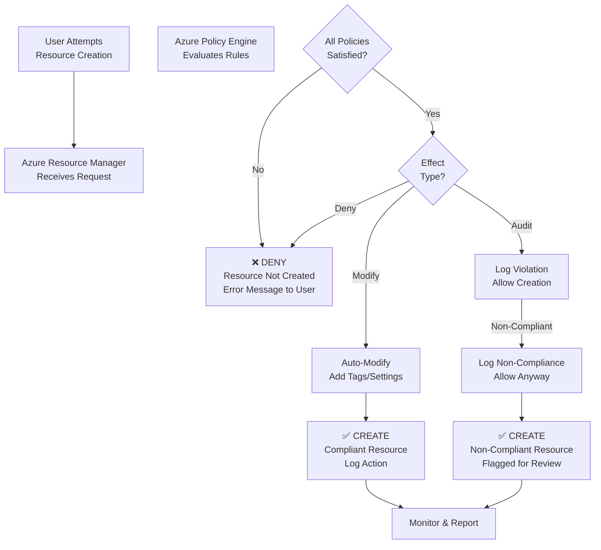
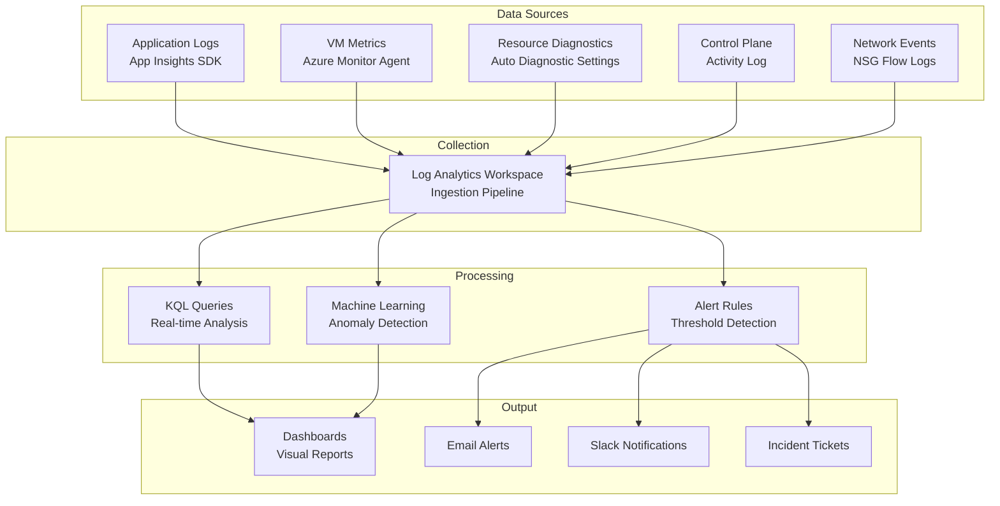
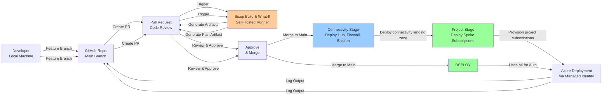
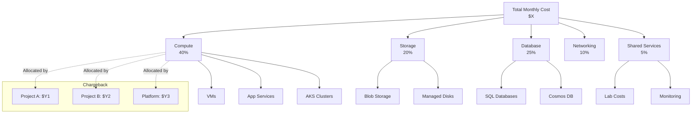
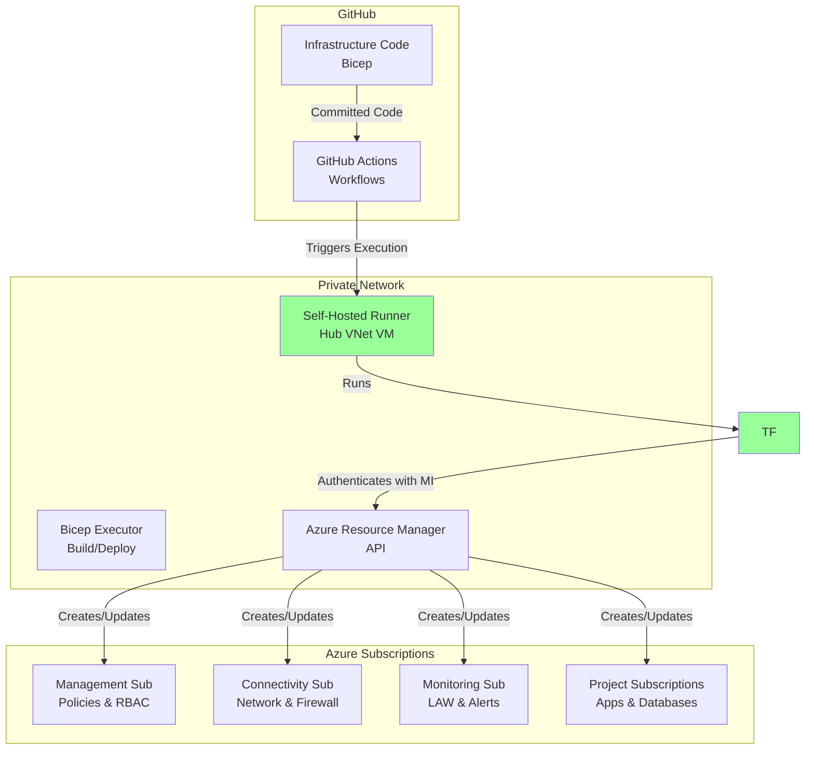

# Architecture Diagrams & Visual Designs

## 1. Overall Landing Zone Architecture

## 2. Management Group & Subscription Hierarchy

## 3. Network Topology - Hub and Spoke

## 4. Security Layers

## 5. Data Flow - Request to Database

## 6. Policy Enforcement Flow

## 7. Monitoring Data Flow

## 8. CI/CD Pipeline Flow

## 9. Cost Allocation Model

## 10. Deployment Topology

---

**Document Version**: 1.0  
**Last Updated**: June 2026
